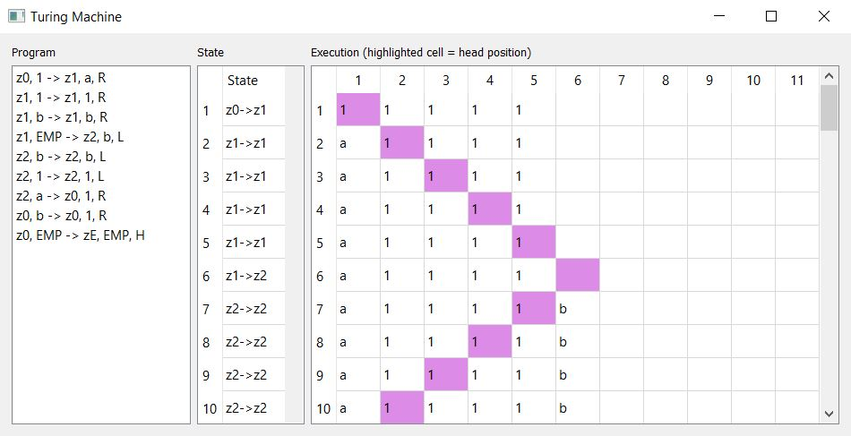

# Turing Machine
Python implementation of the turing machine.

### Info
Did you ever feel the urge to visualize and solve your turing programs? Here you go!



### Alphabet
You can use an alphabet of all letters or numbers. Internally, they are handled as strings.

### Configuration
The initial state of the tape can be configured in the file `initial_state.txt`. The turing program has to be in a textfile.
You can pass the text file as an argument when calling `turing.py`.


### Installation
The program does not need to be installed. You just need to install PyQt5 by executing the following command.

```bash
python -m pip install -r requirements.txt
```

And then, run the program:

```bash
cd src
python turing.py
```

Info: You need to use Python 3. Depending on your Python installation, you have to use the command `python3` instead of `python`.

